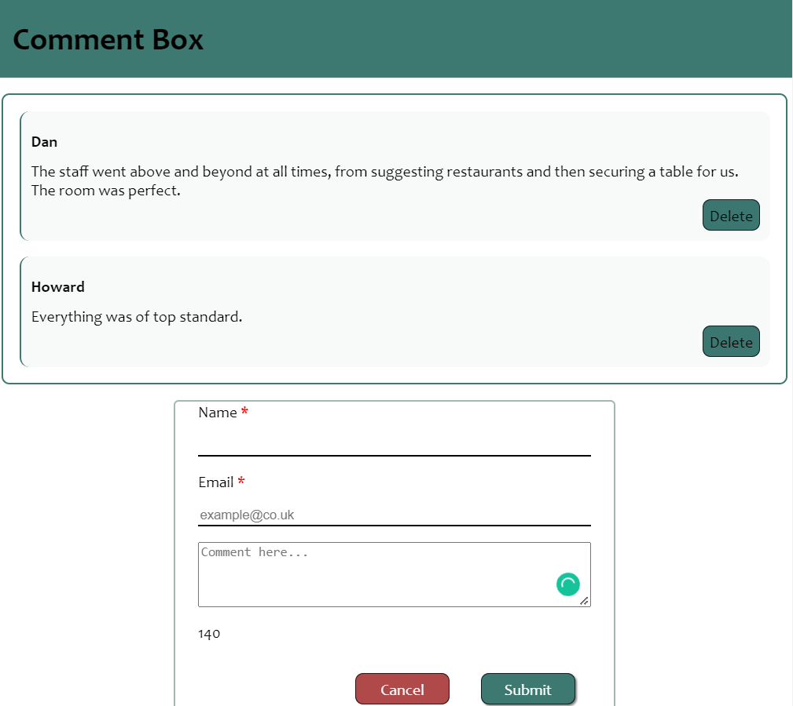
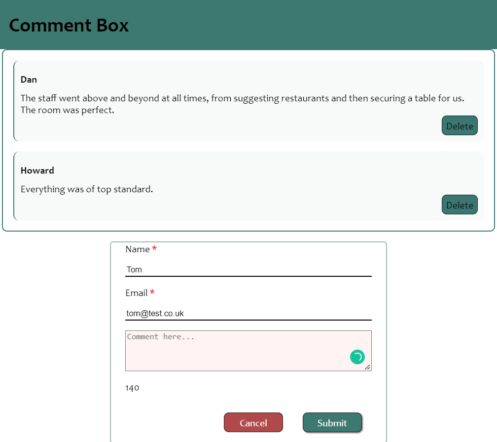

# Comment_Box
see in action https://nataliarusu.github.io/Comment_Box/

This project was created as part of the Founders and Coders application process. 

Requirments:
- Use HTML form elements
- Have inputs for a entering a name, email, and a comment
- Have a submit button
- Check whether the comment exceeds a character count of 140 characters using Javascript
- Display the number of characters as the user types (e.g. 87/140)
- Give user feedback with custom styling on the comment box, when the user exceeds the character limit (e.g. with a coloured border)
- Show each comment on the page when submitted
- Allow the user to submit additional comments, while previous comments remain visible

The top left 'Add comment' button listen for user's click event. 
When clicked, a form is displayed allowing the user to enter a comment. 
Name, Email and Comment are required fields 
If the comment exceeds 140 characters, the submit button becomes inactive. 
The user can delete any of their comments after submitting them by clicking the "Delete" comment button.
   

  
<b>Snapshot 1.</b>:

  </img>
  
comments were added and the add button was clicked,  waiting for the user to add a new comment

  
<b>Snapshot 2.</b>:

  </img>
  
the user clicked submit button with empty comment input,  error style shows comment input is empty

